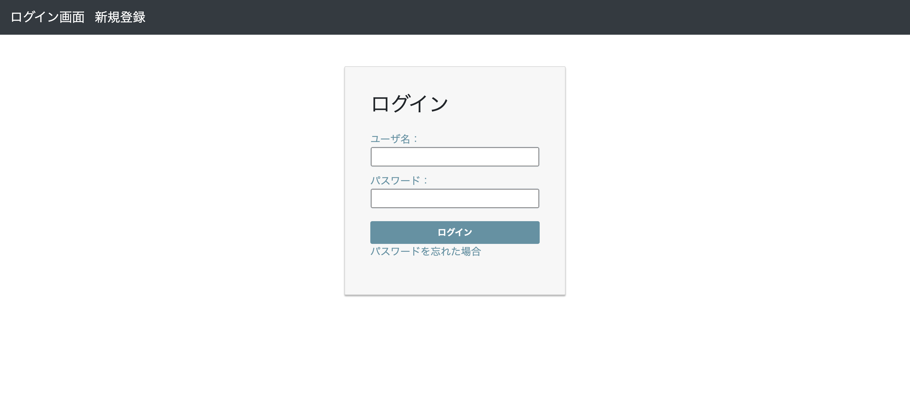
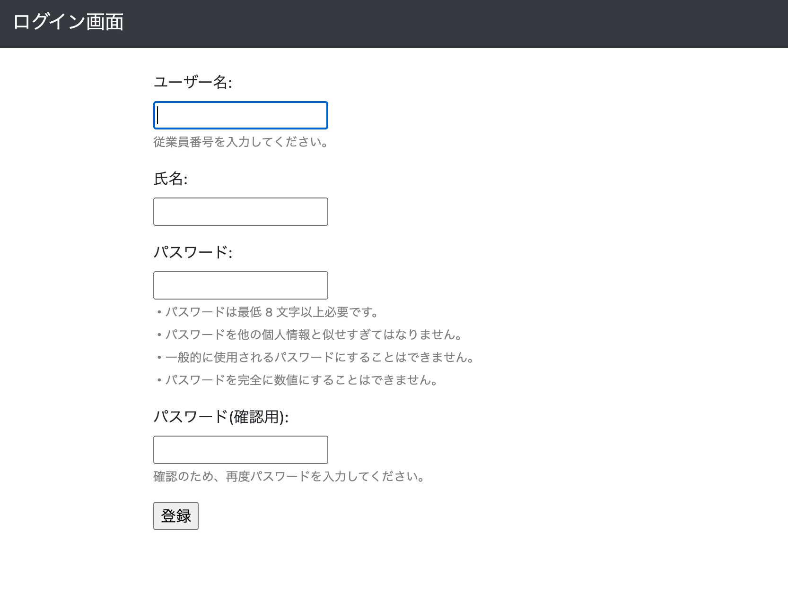
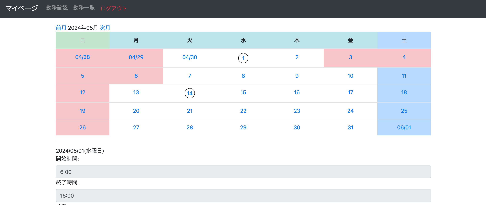
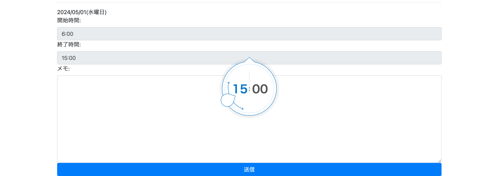
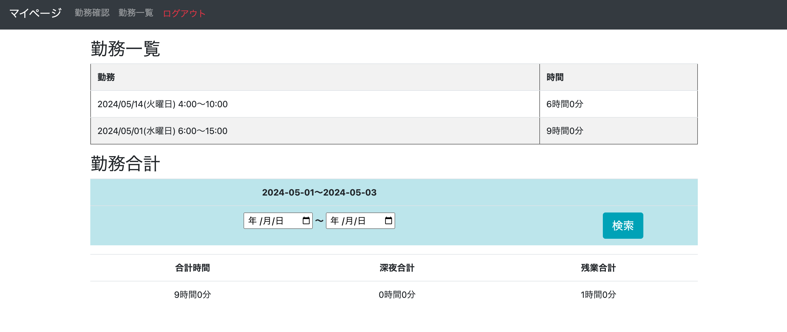
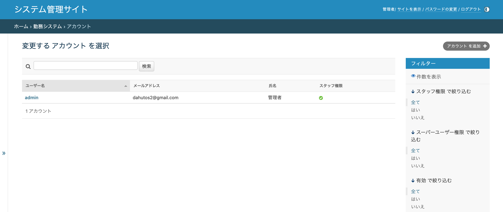
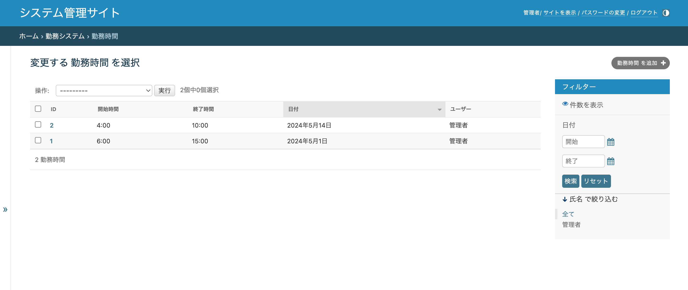

## アプリ紹介
- このアプリは従業員の勤務時間を管理するアプリです。
- frontendとbackendは別れておらずDjangoのみで作成しています。
## 機能
### ユーザ登録
#### ログイン画面

#### ユーザ登録画面

### 勤務時間の入力/確認
#### 月毎の勤務の確認

#### 勤務時間の入力

#### 勤務一覧の確認

### 管理画面
#### ユーザー

#### 勤務時間
